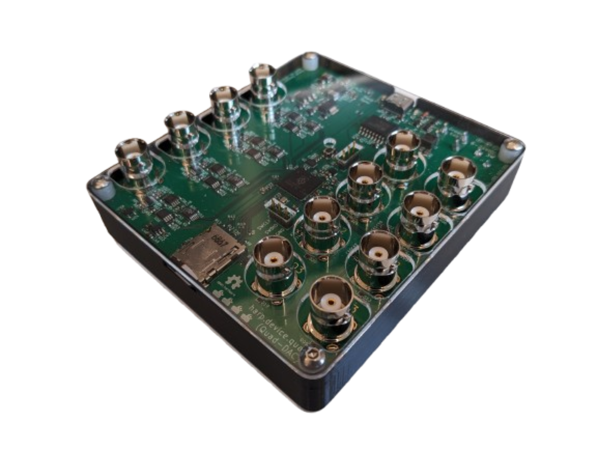
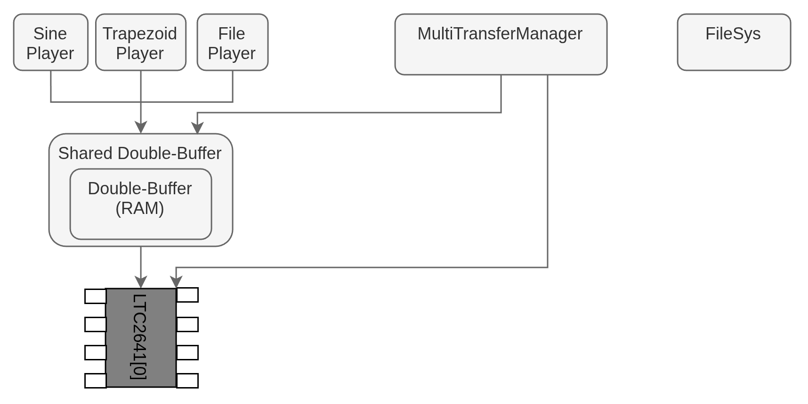
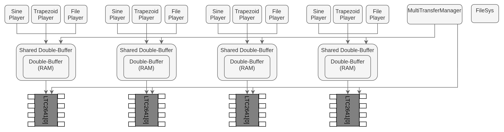
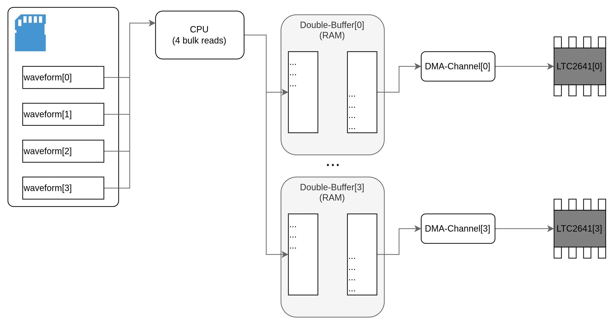
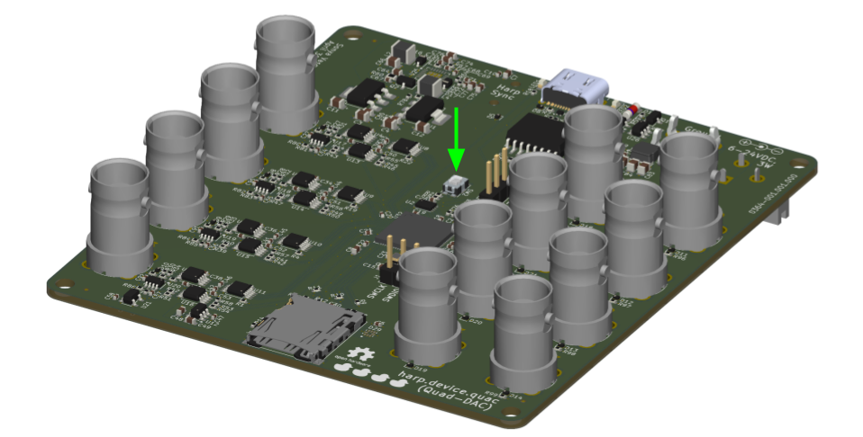

# harp.device.quac
hardware, firmware, and software source files for a Harp-compatible 4-channel Digital-to-Analog Converter.

<p align="center">
  
</p>

## Specs
* Analog Output Channels: 4
* Bit depth: 16-bit
* Update Rate: 100 [Hz] to **500 [KHz]** (selectable per-channel)
  * this is the rate at which a new output value is selected.
* Voltage Swing: ±10 [V]
* RMS noise at the zero voltage setting: ~±2.5 [mV]
* absolute deviation from 0 [V]: ±2.5 [mV]
* Power Input: 12-24 [V]
* Power Input Plug: 2.1 x 5.5mm barrel jack (positive center)
* Reverse Polarity protected.
* Additional M4 _ground lug_ provided for de-noising.
* Open source hardware, firmware, and software.
* Cost-effective at < $300 USD to manufacture a single unit.
* Preview the hardware design online with [KiCanvas](https://kicanvas.org/?repo=https%3A%2F%2Fgithub.com%2FAllenNeuralDynamics%2Fharp.device.quac%2Ftree%2Fdev%2Fhardware).

### Trigger Specs
* Trigger options
  * external trigger
  * software trigger
* User-selectable external trigger mapping, i.e: any input trigger can be setup to trigger any number of analog output channels.
* True simultaneous triggering in cases where multiple waveforms are triggered at the same time.
  
### Waveform Player Specs  
The device features 3 ways to play waveforms: either through the two built-in primitive waveform generators or by playing waveforms pre-uploaded to an SD card.

#### File Player Specs  
* Max Data Storage: limited by size of SD card
* Max file length for a single file: 4GB
* File names: user-specifiable with a 32-character limit.
* Format: 16-bit Pulse Code Modulation (PCM)
  * -10 Volts corresponds to 0
  * 0 Volts corresponds to ~32768
  * 10 Volts corresponds to 65535
  
### Harp Specs
The Quac board is a fully Harp-protocol-compliant device built on top of the [Harp Pico Core](https://github.com/harp-tech/core.pico).

* Harp Device ID: 1411
* Harp Events
  * Waveform Start (per-channel)
  * Waveform Finished (per-channel)

## Alternates
The harp.device.quac board follows a legacy of many other devices that came before it.
For similar devices, have a look at:
* [Pulse Pal](https://sanworks.io/shop/viewproduct?productID=1102) by Josh Sanders.
* [PCIE-6738](https://www.ni.com/docs/en-US/bundle/pcie-6738-specs/page/specs.html) by National Instruments.

## Ordering ➡ 💸
Stay tuned for a link to order boards directly from PCBWay:

These printed circuit boards are made on-demand.

## Generating Waveforms ﮩ٨ـﮩﮩ٨ـ
There are two ways to generate waveforms: either with one of two primitive waveform generators or by playing files from the SD card.

Setting up and playing a waveform is a simple process for each Analog Output (AO) channel.
1. Specify any external input trigger conditions for the output channel.
2. Specify the Waveform *Player*.
3. Specify the *Player*'s settings.
4. Wait until the Player is ready (< 50[ms] of wait time for the player to apply the settings and arm the waveform).
5. Trigger the player either with a software command or by applying external input to any of the previously configured external input pins.

For fully worked examples of the above steps, see the examples in the [software](./software) folder.

*Player* Settings are detailed below for each *Player*.

### Common Settings
The following settings are common to each *Player*.
* `cycles`: number of iterations of the current settings (will probably be 1 in most cases).
* `duration_us`: duration in microseconds to play the waveform or 0 to either *play-forever* (if the source is infinite ie: periodic functions) or *play-to-completion* (if the source is finite i.e: files on the SD card).
* `update_frequency_hz`: rate at which samples are produced (max 500 [KHz]).

### SinePlayer Waveforms

#### Settings
* `frequency_hz`: sine wave frequency in hertz.
* `amplitude_volts`: "center-to-peak" amplitude in volts.
* `vertical_shift_volts`: vertical shift in volts.

  

#### Example Settings: play a 10Hz sine wave for 3 seconds
| Setting                | Value   | Note                                 |
|------------------------|---------|--------------------------------------|
| `cycles`               | 1       | play the following settings once     |
| `duration_us`          | 3000000 | play for 3 seconds                   |
| `update_frequency_hz`  | 10000   | rate at which to produce new samples |
| `frequency_hz`         | 10      |                                      |
| `amplitude_volts`      | 0.5     | result will be 1 [V] peak-to-peak    |
| `vertical_shift_volts` | 0.5     | result will span 0 [V] to 1 [V]      |

#### Example Settings: play a 10Hz sine wave forever
  | Setting                | Value | Note                               |
|------------------------|-------|--------------------------------------|
| `cycles`               | 1     | play the following settings once     |
| `duration_us`          | 0     | play forever (until aborted)         |
| `update_frequency_hz`  | 10000 |                                      |
| `frequency_hz`         | 10    |                                      |
| `amplitude_volts`      | 0.5   | result will be 1 [V] peak-to-peak    |
| `vertical_shift_volts` | 0     | result will be centered around 0 [V] |

### TrapezoidPlayer Waveforms
* `frequency_hz`: sine wave frequency in hertz.
* `amplitude_volts`: "center-to-peak" amplitude in volts.
* `vertical_shift_volts`: vertical shift in volts.
* `ramp_on_us`
* `ramp_off_us`


#### Settings
* `path`: filepath on the SD card (32-character limit max)

  
  
### FilePlayer Waveforms from the SD Card 💾

#### Settings
* `path`: filepath on the SD card (32-character limit max)

#### Example Settings: play a file once
| Setting               | Value         | Note                                                            |
|-----------------------|---------------|-----------------------------------------------------------------|
| `cycles`              | 1             | play the following settings once                                |
| `duration_us`         | 0             | play the file to completion                                     |
| `update_frequency_hz` | 500000        | max update rate (might be different depending on file).         |
| `path`                | channel_0.bin | assumes this file exists at the top level folder in the SD card |

#### Example Settings: play a file multiple times
| Setting               | Value         | Note                                       |
|-----------------------|---------------|--------------------------------------------|
| `cycles`              | 3             | loop back and play the entire file 3 times |
| `duration_us`         | 0             |                                            |
| `update_frequency_hz` | 500000        |                                            |
| `path`                | channel_0.bin |                                            |


The _quac_ board reads files in 16-bit little-endian _Pulse-Code Modulation_ (PCM) format.
There are a few options for generating waveforms in this format.

#### Upscaling Existing Files 💽
It's possible to convert existing audio files to a format compatible with the _quac_ board using `ffmpeg`.
To upscale an existing _\*.wav_ file to a compatible format, use:
```bash
ffmpeg -i example.wav -f u16le -ar 500000 output.raw
```

#### With numpy 💻
For more complicated waveforms that do not derive from an existing audio file, we recommend using numpy.

Here's an example to generate the [North American Ringing Tone](https://en.wikipedia.org/wiki/Ringing_tone#Bell_System_tones), which is the sum of a 440Hz and 480Hz sine wave.

```python
import numpy as np

NUM_SAMPLES = int(5e6) # 5 million samples @ 500KSs -> 10 seconds of data.
SAMPLES_PER_SECOND = 500000.
FULL_SCALE_RANGE = (1 << 16) - 1 # 16 bit resolution
SECONDS = NUM_SAMPLES/SAMPLES_PER_SECOND
FILENAME = f"channel_0.bin"

t = np.linspace(0, SECONDS, NUM_SAMPLES)
x = np.zeros(NUM_SAMPLES)

# make sine wave. offset it to uint16 range: 0-65535
for freq in [440, 480]:
    x += (np.sin(2 * np.pi * freq * t)+1)/2 * FULL_SCALE_RANGE/2

# Write result to file in 16-bit little-endian format.
with open(FILENAME, "wb") as file:
    x.astype("<u2").tofile(file)

```

#### Uploading Waveforms ♒︎➝💾
Currently waveforms must be uploaded to the SD card manually.
Waveforms must be placed at the top level (not inside a folder!) and be labeled `channel_<i>.bin` where `<i>` could be `0`, `1`, `2`, or `3` corresponding to waveform 0-3 respectively.

> [!WARNING]
> Power down the device before removing or inserting the SD card.

## Playing Waveforms 🎶
There are two ways to trigger a configured waveform to play: via software command or through the device's external triggers labeled **DI0**, **DI1**, **DI2**, and **DI3**.

Before triggering a waveform, you must

### Software Triggering
For fully worked examples in both Bonsai and Python, see the [software examples folder](./software).

### External Triggering
By default the device's power-on-reset behavior is setup to:
1. load the _FilePlayer_ on all four channels.
2. Search for files named `channel_0.bin` - `channel_3.bin` and arm them.
3. Setup external triggers such that pins _DIO_ - _DI3_ correspond to playing _channel\_0.bin_ - _channel\_3.bin_ on output pins _A0_ - _A3_ respectively.

Trigger mapping is configurable!
i.e: any input trigger can be configured to trigger any number of outputs.
To alter the trigger mapping, you must use software commands through either Bonsai or Python.

## Compatible SD Cards 💾
During normal operation, up-to-four waveforms stored on the SD card are read (interleaved) at 4MB per second.
With the extra overhead of switching between files, the SD card must be able to support read speeds ≥8MB per second.
In theory, any _Class 10 SD Card_ formatted in _FAT32 format_ should be compatible.

But since card performance can vary, here's a list of tested cards:
| Vendor    | Model                   |
|-----------|-------------------------|
| Samsung   | Pro Plus 8GB Smart Card |
| GIGASTONE | Industrial 8GB MLC      |
|           |                         |

## Working Principle

### Selectable Player Architecture
Each channel features a modular approach to dividing up the work of playing waveforms.
<p align="center">
  
</p>

The level closest to the hardware is a driver that wraps a custom PIO program to communicate over SPI to each LTC2641 DAC chip.

The next stage up is a shared double buffer and two DMA channels responsible for ensuring that the driver receives an uninterrupted, steady stream of bytes paced by a DMA Timer setup to match the user-requested playback rate.
Inspecting the state of the double buffer is implemented by reading single registers native to the Pico's DMA peripherals to eliminate the need to implement mutex locks to check multiple locations in memory concurrently.

The layer above features one of multiple ways of generating data.
These _Players_ are responsible for producing a sequence of bytes up to the limits specified by the user's waveform settings.
Each _Player_ is derived from a base class that manages sending data to the corresponding available buffer from the downstream double buffer and manages sequence arming and termination.

In the full architecture, four copies of the above pipeline exist like so:

<p align="center">
  
</p>

The `MultiTransferManager` connects to each double buffer and driver and handles triggering an armed transfer, and it guarantees that multiple simultaneous requests to start a transfer occur simultaneously.

### FilePlayer Streaming Pipeline
<p align="center">
  
</p>

## Updating the Firmware
New firmware is available on the [Releases Page](https://github.com/AllenNeuralDynamics/harp.device.quac/releases).
To upload new firmware to the device, do the following:
1. Ensure that the board is connected to a PC with the USB cable.
1. Power down the board. (Note that power comes from the barrel jack, _not_ the USB cable.)
2. Power on the board with the _BOOTSEL_ button held down. Then release the BOOTSEL button once the board has been powered up. The device will now appear on the connected PC as a flash drive. See the figure below to identify the BOOTSEL button. You may need to use a hex key to access this button with the case lid attached. 
<p align="center">
  
</p>

4. Drag and drop the **\*.uf2** firmware file into the flash drive's top level directory. The flash drive should disappear indicating that the firmware upload worked. The device now has new firmware.

## Known Limitations
Currently the device has some known limits, many of which are planned to be eclipsed by future firmware releases.
This non-comprehensive list includes:
* [SinePlayer cannot specify phase shift]()
* [TrapezoidPlayer cannot specify pulse width]()
* [FilePlayer cannot deterministically play a subset of a file multiple times]()
* Waveforms cannot yet be uploaded to the SD card directly over USB.

For a full list of issues, head over to the project's [issues page](https://github.com/AllenNeuralDynamics/harp.device.quac/issues).
