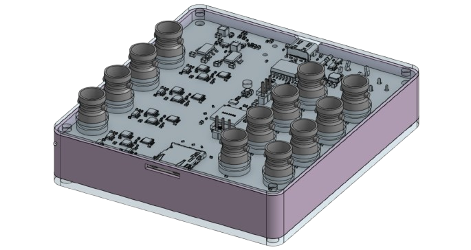
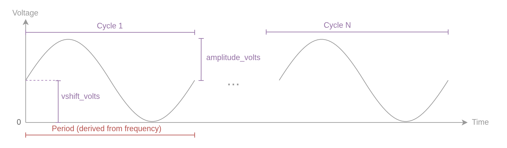
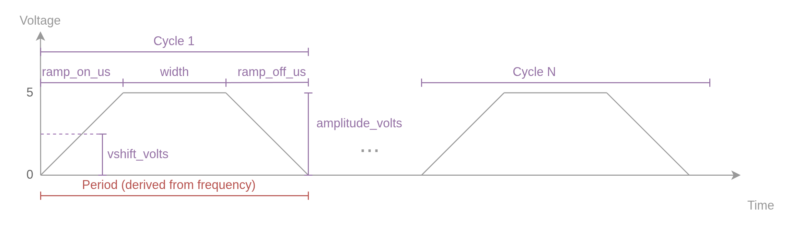

# harp.device.quac
hardware, firmware, and software source files for a Harp-compatible 4-channel DAC



## Compatible SD Cards 💾
During normal operation, up-to-four waveforms stored on the SD card are read (interleaved) at 4MB per second.
With the extra overhead of switching between files, the SD card must be able to support read speeds ≥8MB per second.
In theory, any _Class 10 SD Card_ formatted in _FAT32 format_ should be compatible.

But since card performance can vary, here's a list of tested cards:
| Vendor    | Model                   |
|-----------|-------------------------|
| Samsung   | Pro Plus 8GB Smart Card |
| GIGASTONE | Industrial 8GB MLC      |
|           |                         |

## Generating Waveforms ﮩ٨ـﮩﮩ٨ـ
There are two ways to generate waveforms: either with one of two primitive waveform generators or by playing files from the SD card.

### SinePlayer Waveforms

  
  
### TrapezoidPlayer Waveforms

  

### Waveforms from the SD Card 💾

The _quac_ board reads files in 16-bit little-endian _Pulse-Code Modulation_ (PCM) format.
There are a few options for generating waveforms in this format.

#### Upscaling Existing Files 💽
It's possible to convert existing audio files to a format compatible with the _quac_ board using `ffmpeg`.
To upscale an existing _\*.wav_ file to a compatible format, use:
```bash
ffmpeg -i example.wav -f u16le -ar 500000 output.raw
```

#### With numpy 💻
For more complicated waveforms that do not derive from an existing audio file, we recommend using numpy.

Here's an example to generate the [North American Ringing Tone](https://en.wikipedia.org/wiki/Ringing_tone#Bell_System_tones), which is the sum of a 440Hz and 480Hz sine wave.

```python
import numpy as np

NUM_SAMPLES = int(5e6) # 5 million samples @ 500KSs -> 10 seconds of data.
SAMPLES_PER_SECOND = 500000.
FULL_SCALE_RANGE = (1 << 16) - 1 # 16 bit resolution
SECONDS = NUM_SAMPLES/SAMPLES_PER_SECOND
FILENAME = f"channel_0.bin"

t = np.linspace(0, SECONDS, NUM_SAMPLES)
x = np.zeros(NUM_SAMPLES)

# make sine wave. offset it to uint16 range: 0-65535
for freq in [440, 480]:
    x += (np.sin(2 * np.pi * freq * t)+1)/2 * FULL_SCALE_RANGE/2

# Write result to file in 16-bit little-endian format.
with open(FILENAME, "wb") as file:
    x.astype("<u2").tofile(file)

```

#### Uploading Waveforms ♒︎➝💾
Currently waveforms must be uploaded to the SD card manually.
Waveforms must be placed at the top level (not inside a folder!) and be labeled `channel_<i>.bin` where `<i>` could be `0`, `1`, `2`, or `3` corresponding to waveform 0-3 respectively.

> [!WARNING]
> Power down the device before removing or inserting the SD card.

## Playing Waveforms 🎶
By default the device's power-on-reset behavior is setup to play channel data from an external trigger where trigger pins _DIO_ - _DI3_ correspond to playing _channel\_0.bin_ - _channel\_3.bin_ on output pins _A0_ - _A3_ respectively.

To alter this behavior, you must use software commands through either Python or Bonsai to change this behavior.
Using Python or Bonsai enables full control of the device's available features.
